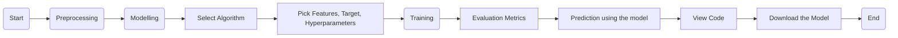

# Expert System

Expert System is a platform that allows users to do preprocessing, build, train, and test Machine Learning models without any programming languages. Designed to make Machine Learning accessible to everyone, this project provides an interface to handle the entire Machine Learning workflow.

## Key Features

- **Data Upload:** Easily upload datasets for processing and analysis, or choose from one of the sample datasets available.
- **Preprocessing:** Perform 
  - Encoding
  - Scaling 
  - Handling Missing Values
- **Algorithm Selection:** Choose from:
  <table>
    <tr>
      <th>Classification</th>
      <td>
        KNN, 
        Naive Bayes, 
        Logistic Regression, 
        SVM, 
        Decision Tree, 
        Random Forest
      </td>
    </tr>
    <tr>
      <th>Regression</th>
      <td>
        Linear Regression,
        Lasso Regression,
        Ridge Regression,
        Decision Tree,
        Random Forest,
      </td>
    </tr>
    <tr>
      <th>Clustering</th>
      <td>
        K-Means,
        Hierarchical Clustering
      </td>
    </tr>
  </table>

- **Customization:** Select features, target variables, and fine-tune hyperparameters.
- **Model Building:** Train models using selected configurations.
- **Predictions:** Generate predictions using the trained model.
- **Evaluation Metrics:**
  - Accuracy, Precision, Recall, F1 Score (for classification)
  - MAE, MSE, RMSE, R-Squared (for regression)
  - Inertia, Silhouette Score (for clustering)
- **Visualization:** Generate visualizations like heatmaps, scatters, cluster plots and dendrograms.
- **Sample Code:** View sample Python code for the training process.
- **Model Download:** Export trained models as `.pkl` files for reuse.
- **Learn**: Learn about Data Science and Machine Learning concepts using the notes available.


Expert System is especially aimed at students who want to explore Machine Learning concepts without the complexities of coding.

### [Screenshots](./SCREENSHOTS.md)


## Workflow




## Technologies Used


 


## Usage

1. Clone the project:
  
    ```
    git clone https://github.com/akshay-rajan/expertsystem.git
    ```
    
2. Navigate to the project directory:

    ```
    cd expertsystem
    ```
3. Create a virutal environment:

    ```bash
    python -m venv myenv
    ```

4. Activate the virtual environment:
    - **Linux / MacOS**
      
      ```bash
      source myenv/bin/activate
      ```
    
    - **Windows**
      
      ```bash
      .\myenv\Scripts\activate
      ```

5. Install the requirements:

    ```bash
    pip install -r requirements.txt
    ```

6. Run database migrations:

    ```bash
    python manage.py migrate
    ```

7. Start the Django server:

    ```bash
    python manage.py runserver
    ```
    
The application will be accessible at at http://127.0.0.1:8000/ .

---

